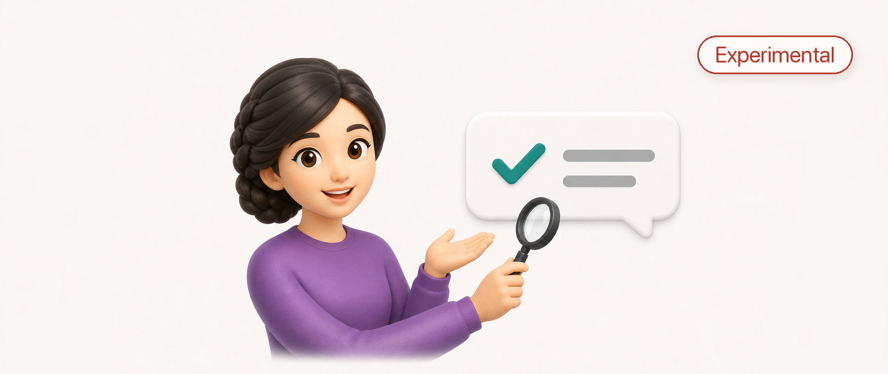

<p align="center">
  
</p>

<h1 align="center">IIRY</h1>

<p align="center">
  <strong>Is It Really You?</strong><br>
  A [hackathon](https://bmi.usercontent.opencode.de/eudi-wallet/developer-guide/hackathon/) prototype for binding a German EUDI Wallet holder presentation to a JPEG.
</p>

<p align="center">
  <a href="https://www.swift.org/"></a>
  
  <a href="https://fastapi.tiangolo.com/"></a>
  
  
  <a href="https://c2pa.org/"></a>
  <a href="docs/cawg-eudi-extension.md"></a>
  <a href="https://openid.net/specs/openid-4-verifiable-presentations-1_0-final.html"></a>
  
</p>

This hackathon MVP binds a German EUDI Wallet Verifiable Presentation to a JPEG. This can be useful, for example, to commit to a screenshot of a WhatsApp conversation. In the case of a request for something, this would give the receiver another signal whether or not the request is genuine. 

While this may sound a lot like chat forensics, the security claim actually is **attested image provenance**:
> This exact image is cryptographically bound to a fresh German EUDI Wallet holder presentation for the disclosed identity attributes, and the binding verified.

IIRY does **not** prove that a WhatsApp account belongs to the wallet holder, that the conversation content is true, or that a bank-transfer request by itself is legitimate. It proves image binding, credential presentation verification, holder-binding freshness, and verifier policy checks.

## Quick Links

- [Parts](#parts)
- [Core Idea](#core-idea)
- [Nonce Payload](#nonce-payload)
- [C2PA Status](#c2pa-status)
- [Build](#build)
- [References](#references)

## Demo Shape

| Surface | Role |
| --- | --- |
| iPhone app | Captures or imports an image, shows the human challenge text, runs the wallet flow, and exports an IIRY carrier. |
| Shared Swift core | Implements nonce encoding, asset hashing, proof-bundle encoding, carrier parsing, JPEG/C2PA insertion, and validation. |
| macOS CLI | Verifies IIRY carriers and JPEGs through the same `IIRYCore` implementation used by the app. |
| FastAPI service | Drives the OpenID4VP relying-party flow and returns wallet response material to the app. |

## Parts

- `ios/IIRY.swiftpm`: SwiftUI iPhone app and the shared `IIRYCore` code.
- `cli/Sources/IIRYCLI`: macOS CLI that uses the same `IIRYCore` package as the iPhone app.
- `service/iiry_service`: FastAPI relying-party service for OpenID4VP / German EUDI Wallet callbacks.
- `docs/cawg-eudi-extension.md`: lean CAWG extension proposal for OpenID4VP holder-bound EUDI presentations.

## Core Idea

[Content Credentials](https://c2pa.org/) are the user-facing provenance experience built around the technical standards from the [Coalition for Content Provenance and Authenticity (C2PA)](https://spec.c2pa.org/specifications/specifications/2.3/specs/C2PA_Specification.html) for digital assets. The [Creator Assertions Working Group (CAWG)](https://cawg.io/identity/1.3-draft+vc-vp/) adds identity assertions that can bind a credentialed actor to C2PA assertions.

CAWG's draft VC+VP identity assertion currently builds on the W3C standard for W3C Verifiable Credentials / Presentations. The German EUDI Wallet flow used here, however, returns an OpenID4VP presentation. That is not the same object shape as the CAWG draft's W3C VC/VP binding.

IIRY therefore uses an extension signature type:

```text
io.github.ndurner.iiry.cawg.openid4vp.holder-binding.v1
```

The extension keeps the CAWG idea of an identity assertion that references the C2PA hard-binding assertion, but the holder proof is validated through OpenID4VP semantics:

1. Verify the C2PA manifest and hard binding for the JPEG.
2. Read the IIRY/CAWG OpenID4VP assertion.
3. Decode the OpenID4VP nonce payload.
4. Verify that the nonce contains both a digest of the C2PA asset-binding material and a fresh random nonce.
5. Verify the Wallet presentation holder binding over the same nonce.
6. Verify issuer trust, disclosure integrity, audience, freshness, and policy.

The OpenID4VP `nonce` is originally a verifier transaction challenge. In holder-bound presentations it helps bind the proof to this verifier and this transaction, preventing presentation injection and replay. IIRY extends this to include the image binding: the Wallet signs a holder-binding proof over the OpenID4VP nonce, and that nonce contains the digest of IIRY's image-binding material.

## Nonce Payload

The nonce passed in the OpenID4VP request is built like this:

```text
base64url(deterministic-cbor([
  "io.github.ndurner.iiry.openid4vp-nonce.v2",
  2,
  random_256_bits,
  sha256(c2pa_asset_binding_material)
]))
```

The human challenge text, for example:

```text
Is it really you?
(2026-06-04 ABCD1234)
```

is intentionally **not** part of this nonce payload. It must be visible in the image itself and checked by the receiver. If the challenge is not captured in the image, IIRY can still prove that a wallet presentation was bound to those image bytes, but it cannot prove that the image answered the parent's latest challenge.

## File Naming

The app exports a branded transport file:

```text
IIRY-Commitment-YYYY-MM-DD-ABCD1234.jpg.c2pa.cawg.iiry
```

`Commitment` is deliberate: the file contains a cryptographic commitment and evidence, not a blanket confirmation that the content is true. The `.jpg` segment keeps the ordinary image nature visible, `.c2pa.cawg` makes the technical choices visible during a no-slides demo, and the final `.iiry` extension lets iOS route the file back into IIRY. Dots are safer than `+` for document-type routing and share-sheet handling.

## C2PA Status

The shared Swift core now implements a constrained **IIRY JPEG/C2PA profile**. It writes and reads JPEG APP11 C2PA/JUMBF segments, creates a `c2pa.hash.data` hard-binding assertion with exclusion ranges, stores the IIRY proof-bundle assertion, writes a CBOR `c2pa.claim.v2`, and signs that claim as a detached COSE_Sign1 ES256 C2PA claim signature. The iPhone app and CLI use this same implementation.

For hackathon development the Swift core uses the same sample ES256 certificate/key material bundled with `c2patool` / `c2pa-rs`. That lets local reference tooling validate the C2PA mechanics, but it does **not** establish production signing-credential trust and must not be presented as a trusted Content Credential signer.

The CLI supports two verification modes for C2PA-bearing JPEGs:

- `iiry verify <image.jpg> --own` verifies the Swift IIRY profile.
- `iiry verify <image.jpg> --c2patool` asks local `c2patool -d` whether the asset satisfies the reference C2PA verifier.
- `iiry verify <image.jpg> --both` runs both and exposes disagreement.
- `iiry verify <image.jpg> --c2patool --trust-c2pa-sample` repeats the reference check while explicitly trusting the C2PA ES256 sample root anchor for local development only.

For IIRY-generated JPEGs, the expected default `c2patool` development result is that `assertion.dataHash.match`, `assertion.hashedURI.match`, and `claimSignature.validated` pass, while `signingCredential.untrusted` fails. With `--trust-c2pa-sample`, the C2PA layer should report `validation_state: Trusted`; this is still sample trust, not production trust. Separately, generic C2PA tooling will not understand IIRY's proposed CAWG/OpenID4VP proof-bundle semantics until that extension is standardized or explicitly supported.

The web service does not execute `c2patool` and does not receive JPEG bytes for C2PA processing. It only drives the OpenID4VP relying-party flow and returns the Wallet response material to the app.

## Acknowledgements

IIRY is a prototype implementation built on public standards and reference ecosystems:

- The C2PA/JUMBF/JPEG manifest work is implemented in Swift for this repository, guided by the Coalition for Content Provenance and Authenticity (C2PA) technical specification and checked for interoperability against [`c2patool`](https://github.com/contentauth/c2pa-rs/tree/main/cli).
- The CAWG identity model and the proposed OpenID4VP extension build on the Creator Assertions Working Group draft VC+VP identity assertion.
- The development-only ES256 certificate and private key embedded in `IIRYCore` are the sample testing material from the `c2patool` / [`c2pa-rs`](https://github.com/contentauth/c2pa-rs) ecosystem. They are included only so the hackathon prototype can exercise C2PA signing mechanics and reference-tool verification; they must not be treated as production signing credentials.
- The relying-party service follows the OpenID4VP and German EUDI Wallet sandbox flow. Production deployments need real relying-party key material, certificates, trust policy, and operational review.
- The iOS app uses Apple platform frameworks including SwiftUI, PhotosUI, Uniform Type Identifiers, UIKit sharing, and CryptoKit. The service uses the Python FastAPI ecosystem listed in `service/requirements.txt`.

## Web Service Serialization

The service can persist decrypted wallet presentation results for local CLI testing, but only when explicitly enabled:

```bash
IIRY_SERIALIZE_PRESENTATIONS=1
```

By default it stores sessions only and does not write serialized VP artifacts for reuse.

## Build

Build and test the shared Swift core and macOS CLI:

```bash
swift test
swift run iiry --help
```

Run the service:

```bash
python3 -m venv .venv
. .venv/bin/activate
pip install -r service/requirements.txt
uvicorn iiry_service.app:app --app-dir service --reload --port 8110
```

The service expects RP key and German EUDI sandbox certificate material through environment variables or `service/secrets/`, matching the structure described in `service/iiry_service/app.py`.

## References

- [Content Credentials / C2PA](https://c2pa.org/)
- [C2PA Technical Specification 2.3](https://spec.c2pa.org/specifications/specifications/2.3/specs/C2PA_Specification.html)
- [CAWG draft VC+VP identity assertion](https://cawg.io/identity/1.3-draft+vc-vp/)
- [OpenID4VP 1.0 final](https://openid.net/specs/openid-4-verifiable-presentations-1_0-final.html)
- [RFC 9901: Selective Disclosure for JWTs](https://www.rfc-editor.org/rfc/rfc9901.html)
